# 🚗 AI 기반 고객 맞춤형 자동차 추천 및 영업전략 자동화 시스템

현대·기아차 실제 판매 데이터를 활용하여 고객 세분화·차량 추천·판매 예측·실시간 리포트 및 마케팅 자동화까지 아우르는 실전형 데이터 분석/AI 플랫폼

## 📂 데이터 및 분석 프로세스

### 📥 데이터 수집 및 구성
- **내부 실적 데이터**: 현대·기아차 2023~2025년 판매·수출 데이터 (차종/국가/공장/월별 포함)
        데이터 링크 : https://drive.google.com/file/d/12HKQzatQsYrVRNyhZygPVDesuAUaKtvL/view?usp=sharing
- **가상 고객 데이터**: ChatGPT로 생성한 국가별 고객 프로필 (이름, 차량 선호, 구매 빈도 등) 
         데이터 링크 : https://drive.google.com/file/d/1BCXIBxBoqvBPdCRR7AxNzrJA-AUcfqDS/view?usp=drive_link
- **외부 보조 데이터**: 국가별 GDP, 기후대, 경쟁사 판매량 등
           데이터 링크 : https://drive.google.com/file/d/1ufUbxoOeEeEFdMHjLs2VZ2lEvanwF25P/view?usp=sharing


## 👥 딜러 전용 대시보드(고객 세분화 및 추천 시스템)
### ✅ (1차) RFM 기반 클러스터링
KMeans (K=4): VIP / 일반 / 신규 / 이탈 가능 고객 분류

입력 피처: 거래방식, 출시일, 구매일, 금액, 빈도 등

**RFM 클러스터링 결과**
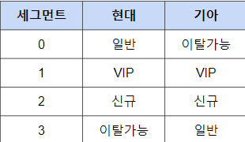

### ✅ (2차) 고객 유형 클러스터링
추가 입력: 성별, 차량유형, 친환경 여부, 연령 등

Elbow method 기반 최적 K 선택 (현대와 기아 고객 데이터 모두 k 값을 6으로 선정)

**현대 고객 엘보우 메소드**
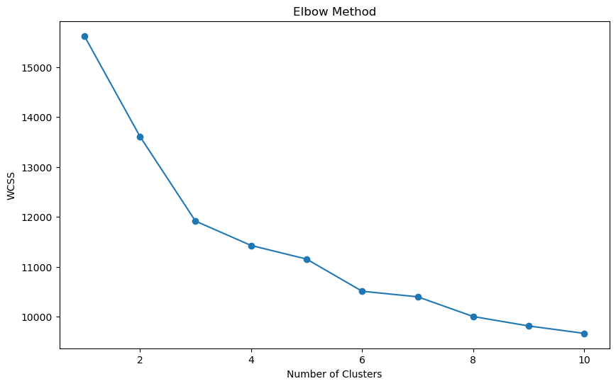
**기아 고객 엘보우 메소드**
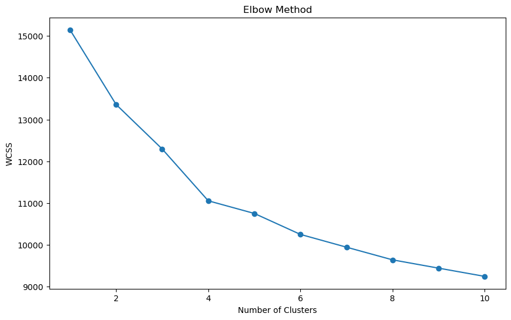

**고객 클러스터  결과**
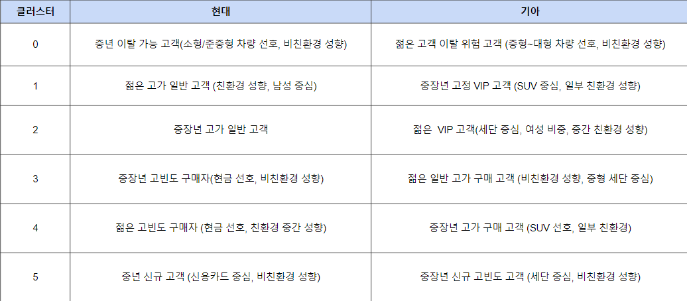


### ✅ 신규 고객 유형 예측

**RFM 클러스터 예측 모델 학습 및 테스트 과정**

``` python
# GradientBoosting/RandomForest 분류 모델
from sklearn.model_selection import train_test_split
from sklearn.ensemble import RandomForestClassifier, GradientBoostingClassifier
from sklearn.metrics import accuracy_score, classification_report
from sklearn.compose import ColumnTransformer
from sklearn.preprocessing import StandardScaler, OneHotEncoder
from sklearn.pipeline import Pipeline

# 1. 입력 데이터 준비
feature_cols = ['성별', '차량구분', '거래방식', '제품출시년월', '제품구매날짜', '친환경차',
                '연령', '거래금액', '구매빈도']
target_col = '고객세그먼트'  # 클러스터링으로 생성된 세그먼트

X = df[feature_cols]
y = df[target_col]

# 2. 학습/테스트 데이터 분할
X_train, X_test, y_train, y_test = train_test_split(
    X, y, test_size=0.2, random_state=42
)

# 3. 전처리 파이프라인 (범주형/수치형 분리)
categorical_features = ['성별', '차량구분', '거래방식', '제품출시년월', '제품구매날짜', '친환경차']
numeric_features = ['연령', '거래금액', '구매빈도']

preprocessor = ColumnTransformer(
    transformers=[
        ('cat', OneHotEncoder(handle_unknown='ignore'), categorical_features),
        ('num', StandardScaler(), numeric_features)
    ]
)

# 4. 분류 모델 파이프라인 (Gradient Boosting 예시)
gb_pipeline = Pipeline([
    ('preprocessor', preprocessor),
    ('classifier', GradientBoostingClassifier(random_state=42))
])

X_train, X_test, y_train, y_test = train_test_split(X, y, test_size=0.2, random_state=42)

# 5. 모델 학습
gb_pipeline.fit(X_train, y_train)

# 6. 예측 및 평가
y_pred = gb_pipeline.predict(X_test)
print("정확도:", accuracy_score(y_test, y_pred))
print(classification_report(y_test, y_pred))

```


**RFM 클러스터링 예측 모델 테스트 결과**
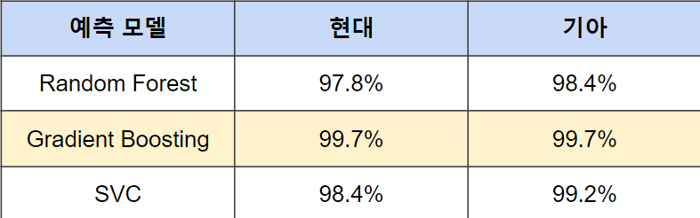


**고객 클러스터 예측 모델 학습 및 테스트 과정**

``` python
import pandas as pd
from sklearn.model_selection import train_test_split
from sklearn.preprocessing import StandardScaler, OneHotEncoder
from sklearn.compose import ColumnTransformer
from sklearn.pipeline import Pipeline
from sklearn.ensemble import RandomForestClassifier
from sklearn.model_selection import train_test_split
from sklearn.metrics import accuracy_score, classification_report

# 범주형, 수치형 데이터 구분분
categorical_cols = ['성별', '차량구분', '거래 방식', '제품 출시년월', '제품 구매 날짜', '고객 세그먼트', '친환경차']
numerical_cols = ['연령', '거래 금액', '제품 구매 빈도']

#입력 데이터
X = data[categorical_cols + numerical_cols]
# 타겟 데이터
y = data['Cluster']

# 전처리 파이프라인(수치형 데이터는 피쳐 스케일링, 범주형 데이터는 원핫 인코딩)
preprocessor = ColumnTransformer(
    transformers=[
        ('num', StandardScaler(), numerical_cols),
        ('cat', OneHotEncoder(handle_unknown='ignore'), categorical_cols)
    ]
)

# 예측 모델 파이프라인인
rf_pipeline = Pipeline([
    ('preprocessor', preprocessor),
    ('classifier', RandomForestClassifier())
])

# 학습, 테스트 데이터 생성성
X_train, X_test, y_train, y_test = train_test_split(X, y, test_size=0.2, random_state=42)

# 모델 학습
rf_pipeline.fit(X_train, y_train)
gb_pipeline.fit(X_train, y_train)
svm_pipeline.fit(X_train, y_train)

# Random Forest
y_pred_rf = rf_pipeline.predict(X_test)
print("Random Forest:")
print(f"Accuracy: {accuracy_score(y_test, y_pred_rf):.3f}")
print("Classification Report:\n", classification_report(y_test, y_pred_rf))


```

**고객 클러스터링 예측 모델 테스트 결과**
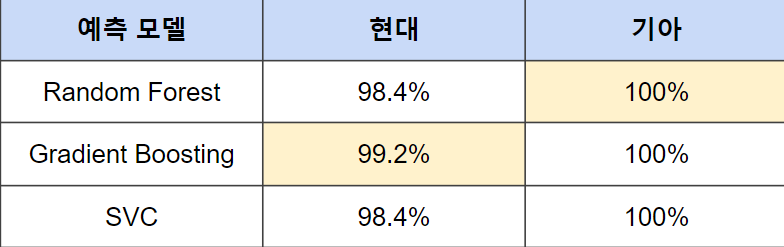


Streamlit 앱에서는 예측에 필요한 고객 정보를 입력하면,
저장된 머신러닝 모델을 통해 해당 고객의 유형(클러스터/세그먼트)을 실시간으로 예측할 수 있습니다.


## 📊 고객 데이터 분석 및 인사이트 제공

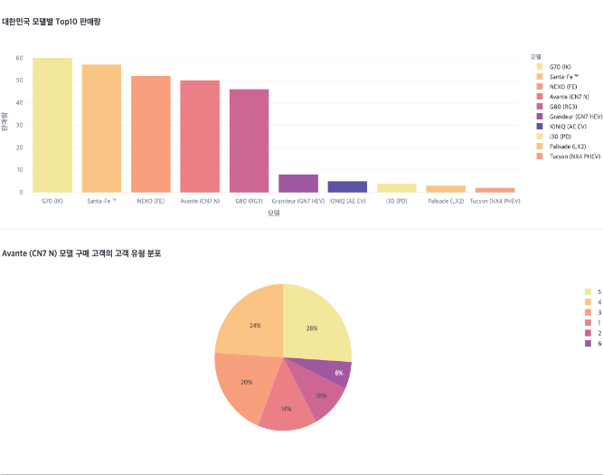

### 🔍 주요 분석 내용
**📌 핵심 분석 지표**
| 분석 항목               | 주요 인사이트                          | 활용 방안                     |
|-------------------------|----------------------------------------|-------------------------------|
| 모델별 구매 클러스터    | Avante - 클러스터5(26%) 집중           | 클러스터5 타겟 프로모션 강화  |
| 지역별 선호 모델        | 서울 - SUV(58%), 부산 - 세단(63%)      | 지역별 차종 재고 최적화       |
| 연령대별 구매 트렌드    | 30대 - 전기차(72%), 50대 - 내연기관(81%)| 연령별 마케팅 메시지 차별화   |

**💡 실제 분석 사례**

**한국 시장 Avante 모델 분석 결과**

- 클러스터5 고객이 전체 구매의 26% 차지 (최다 비중)

- 클러스터4(18%), 클러스터2(15%) 순으로 나타남

**전략 제안**

1. 클러스터5/4 대상 프로모션 강화 (할부 혜택 확대)

2. 클러스터1/2/3/6 대상 테스트 마케팅 진행 (경쟁 모델 비교 광고)

더 많은 분석은 Streamlit 앱에서 확인하실 수 있습니다.


## 📈 글로벌 수출 전략 대시보드(데이터 기반 의사결정, KPI 모니터링, 전략 제안)

### 글로벌 고객 데이터 분석


**1. 해당 지역의 인기 모델 Top 10 확인**
- 선택한 국가 기준 해당 지역 내 판매량 기준 상위 10개 모델 추출
- 바 그래프 및 파이 차트로 시각화하여 판매량과 비중을 시각화

**2. 전체 평균 대비 해당 지역 특이점 분석**
- 전체 데이터에서의 모델별 평균 판매 비중과 해당 지역 내 모델별 판매 비중을 비교
- 해당 지역에서 유난히 많이 팔리는 모델(타 모델 대비하여 판매량이 5% 이상 높은 모델)을 도출
- 대한민국에서 특별히 잘 팔리는 모델: G70- 지역 평균보다 17.2% 높음

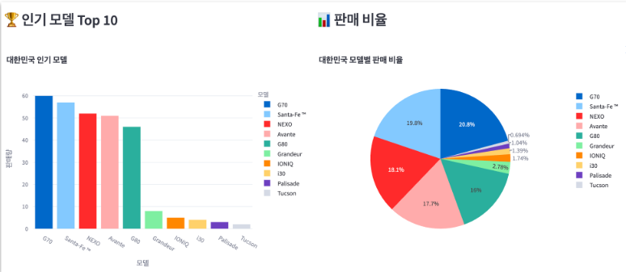


**3. 국가 간 선호도 비교 분석**
- 사용자 선택에 따라 여러 국가을 비교 대상 지역으로 지정 가능
- 전체 상위 5개 모델을 기준으로 지역별 판매량을 교차 테이블 형태로 비교
- Heatmap 으로 시각화

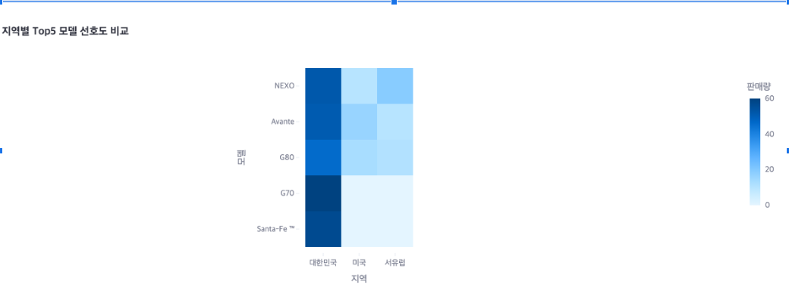


**4. 지역 비교 분석 결과(대한민국 기준)**
- 대한민국에는 NEXO, Avante 등 판매량이 높은 모델 생산량 확충, 프로모션 우선순위 권고 제안


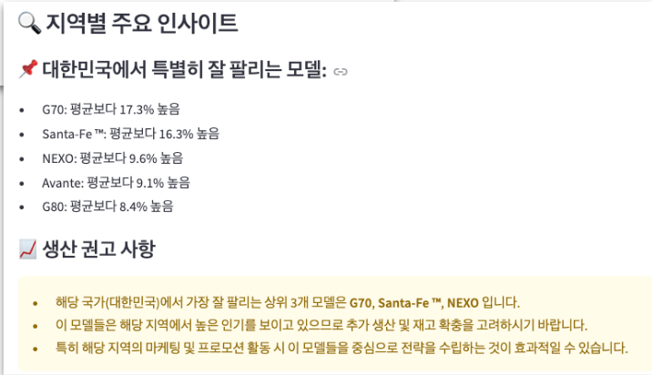


📈 판매/수출/생산 예측
🔮 Prophet 시계열 예측
``` python
from prophet import Prophet

model = Prophet(daily_seasonality=False, weekly_seasonality=False)
model.fit(df_long[['ds', 'y']])
forecast = model.predict(model.make_future_dataframe(periods=12, freq='M'))
```

### 💡 LightGBM 다변량 예측
```python
import lightgbm as lgb

params = {'objective': 'regression', 'metric': 'rmse'}
train_data = lgb.Dataset(X, label=y)
gbm = lgb.train(params, train_data, num_boost_round=100)
```
### 📊 실시간 대시보드
Streamlit 기반 시각화

자동화: 이메일 발송, 보고서 생성, 마케팅 전략 제안

🔁 전체 파이프라인 아키텍처
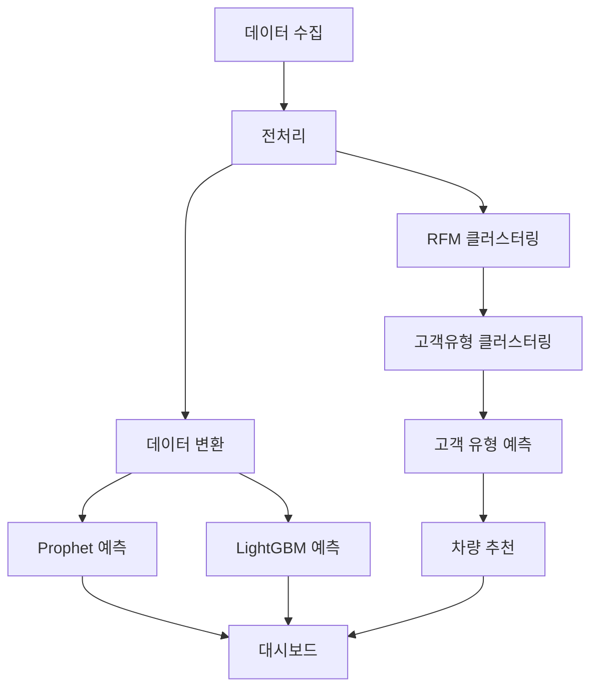

### 🧠 핵심 로직 요약
고객 분석 흐름
고객 정보 입력 → 2. 클러스터링 → 3. 차량 추천 → 4. 결과 발송

판매 예측 흐름
다중 모델 예측 → 2. 트렌드 분석 → 3. 전략 자동화
